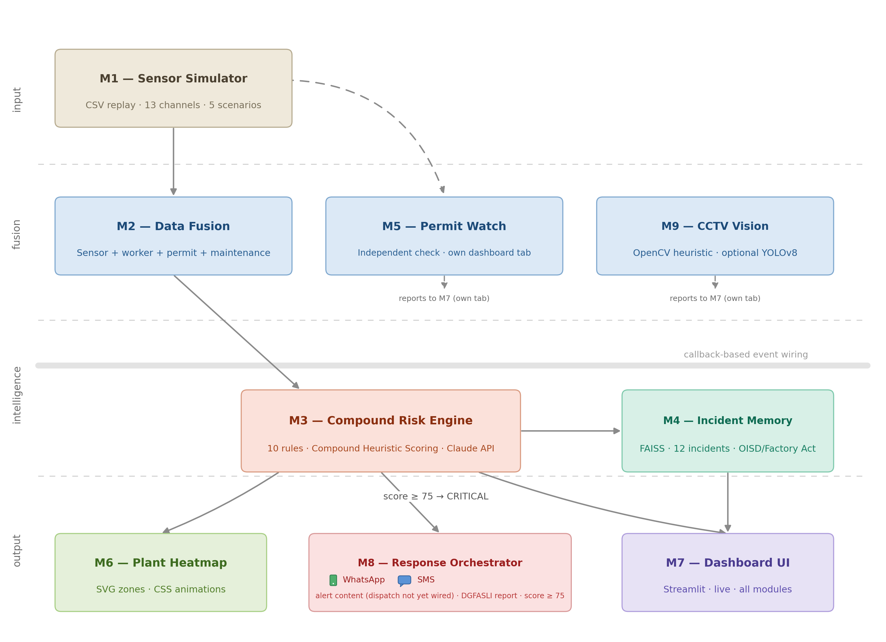

# VIGIL - Compound Risk Intelligence for Zero-Harm Operations

AI-powered industrial safety monitoring prototype built for ET AI Hackathon 2026.

VIGIL watches multiple sensor and permit data streams from a plant at the same time and looks for dangerous combinations of conditions, not just single readings crossing a threshold. Most industrial accidents (like the Vizag Steel Plant explosion, Jan 2025) happen when several individually-normal signals overlap into a fatal condition that no single sensor would have flagged. VIGIL is built to catch that.

## What it does

Simulates live sensor data (gas, temperature, pressure, O2, etc.) across plant zones
Fuses sensor readings with worker location, permit, and maintenance data
Analyzes live CCTV feeds using YOLOv8 to monitor PPE compliance and track worker counts in hazardous zones
Runs 11 compound risk rules (CR-001 to CR-011) against the fused data
Uses a RAG pipeline (FAISS + LangChain) to pull up similar past incidents and relevant regulations (OISD, DGMS, Factory Act) when a risk fires
Cross-checks active work permits against the gas readings that were recorded when the permit was issued
Shows everything on a live Streamlit dashboard, with a plant heatmap and an alert feed
Auto-generates a DGFASLI-style incident report when a zone crosses a critical risk score

## Project structure

```
m1_sensor_simulator/     # replays sensor data from CSV scenarios
m2_data_fusion/          # merges sensor + worker + permit + maintenance data
m3_risk_engine/          # compound risk rules + Claude-based reasoning
m4_rag_incident_memory/  # FAISS incident + regulation lookup
m5_permit_watch/         # permit-vs-sensor conflict checks
m6_plant_heatmap/        # SVG zone map generation
m7_dashboard_ui/         # Streamlit dashboard
m8_response_orchestrator/# alerting + incident report generation
m9_cctv_vision/          # YOLOv8-based PPE compliance and worker counting
```

All modules talk to each other through a shared event bus, not direct calls, so each one can be swapped out on its own.

## Running it

```bash
pip install -r requirements.txt

# Create your local environment file
cp .env.example .env

# Open the .env file and add your Anthropic API key

cd m7_dashboard_ui
streamlit run dashboard.py
```

Pick a scenario from the sidebar dropdown and hit Start. `multizone` is the main demo - three zones running at once, one of them escalates to CRITICAL around T=70s.

Available scenarios: `vizag`, `multizone`, `confined_space`, `gas_leak`,`normal`.

## Tech used

Python, Streamlit, Claude API, FAISS, LangChain, YOLOv8, OpenCV, asyncio, Plotly, pandas.

## Status

This is a hackathon prototype, not a production system. Sensor input is currently simulated from CSV files - in a real deployment M1 would be replaced by actual ESP32/MQTT sensors, and the rest of the pipeline stays the same.

## Architecture


## Author

Pratyaksha Gupta - B.Tech IT, AKGEC Ghaziabad (2023-2027)
